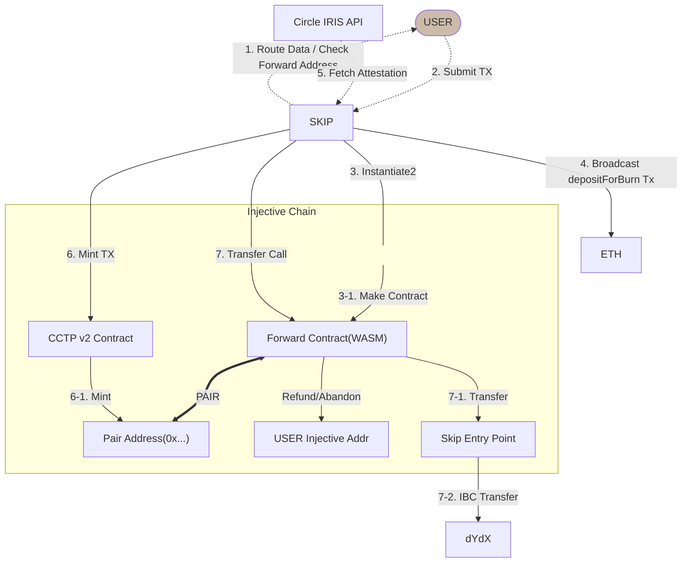

# Forward Contract (WASM)

> **대상 체인:** Injective  
> **작성일:** 2026-05-29  
> **플로우:** ETH → Injective → dYdX (CCTP V2 via Skip)
> **Version:** 0.0.3

[Change Log]

v0.0.4

- Factory Contract 방식

v0.0.3

- 전액 환불 로직 > 요청 단위별 관리

v0.0.2

- Escrow > Forward 명칭 변경
- 메인 키값 Skip relayer address 추가
- Contract State > Skip relayer address 추가

v0.0.1 최초 작성

---

## 1. 개요

Forward Contract는 Injective 체인 위에 배포되는 CosmWasm 컨트랙트로, ETH 체인에서 dYdX 체인으로 USDC를 전송하는 CCTP V2 루트의 중계 역할을 담당한다.

**핵심 역할**

- CCTP V2를 통해 Injective에 민팅된 USDC를 수신하는 **주소** 제공
- 수신된 USDC를 Skip Entry Point를 경유하여 dYdX 목적지 주소로 **IBC 전송**
- 전송 실패시 Injective 주소로 **환불** 기능 제공

---

## 2. 전체 플로우



### 플로우 단계 요약

| 단계 | 주체                    | 내용                                             |
| ---- | ----------------------- | ------------------------------------------------ |
| 1    | SKIP → USER             | 라우트 데이터 전달 및 Forward 주소 확인          |
| 2    | USER → SKIP             | TX 제출                                          |
| 3    | SKIP                    | Injective에 Instantiate2로 Forward Contract 생성 |
| 3-1  | —                       | 고정 주소 생성 완료                              |
| 4    | SKIP → ETH              | `depositForBurn` TX 브로드캐스트 (CCTP)          |
| 5    | Circle → SKIP           | Attestation 조회                                 |
| 6    | SKIP → CCTP             | Mint TX 전송                                     |
| 6-1  | CCTP → Pair Addr        | Injective에 USDC 민팅                            |
| 7    | SKIP → Forward          | Transfer Call 호출                               |
| 7-1  | Forward → Entry Point   | Skip Entry Point로 전송                          |
| 7-2  | Entry Point → dYdX      | IBC Transfer 실행                                |
| —    | Forward → USER Inj Addr | 실패 시 환불/포기 요청 가능                      |

---

## 3. Forward Contract 상세 명세

### 3.1 컨트랙트 식별 키 (Instantiate2)

Forward Contract는 아래 세 값을 조합한 키로 **고정 주소** 를 생성한다.  
동일한 키 조합에 대해서는 항상 동일한 컨트랙트 주소가 반환된다.

| 키 필드                | 타입     | 설명                                      |
| ---------------------- | -------- | ----------------------------------------- |
| `sender_address`       | `String` | 송신자 주소 (ETH 체인의 EVM 주소)         |
| `recipient_address`    | `String` | 수신자 주소 (dYdX 목적지 주소)            |
| `destination_chain`    | `String` | 목적지 체인 식별자 (예: `dydx-mainnet-1`) |
| `skip_relayer_address` | `String` | Skip 릴레이어 식별자                      |

---

### 3.2 메시지 (ExecuteMsg) 명세

#### 3.2.1 `instantiate2`

컨트랙트 최초 배포 시 호출. Sender Address, Recipient Address, Destination Chain을 키값(salt)으로 하여 고정 주소를 가진 Forward Contract를 생성한다.

**트리거:** SKIP이 라우트 설계 시 Forward 주소가 존재하지 않을 경우 배포

**처리:**

1. `(sender_address, recipient_address, destination_chain, skip_relayer_address)` 조합으로 Salt 생성
2. `instantiate2` 명령으로 결정론적 주소 계산 및 컨트랙트 배포

```
Key  = hash(sender_address + recipient_address + destination_chain + skip_relayer_address)
Addr = instantiate2(code_id, init_msg, salt=Key)
```

---

#### 3.2.2 `transferCall`

CCTP V2를 통해 Pair Address(0x...)에 USDC가 민팅된 후 SKIP이 호출한다.  
EVM TX의 hookData를 메모로 이용하여 Skip Entry Point로 전송한다.

**입력 파라미터:**

| 파라미터              | 타입     | 설명                               |
| --------------------- | -------- | ---------------------------------- |
| `hook_data`           | `Binary` | EVM TX의 hookData (memo 생성 원본) |
| `destination_channel` | `String` | IBC 채널 ID                        |
| `mint_tx_hash`        | `String` | USDC Minting TX hash               |

**처리 순서:**

1. `bank_balance_check` — Forward 잔액 조회
2. 요청 데이터 STATE에 저장
3. `hook_data`를 포함한 IBC 메모(memo) 구성
4. Skip Entry Point Contract로 토큰 + 메모 전송
5. Entry Point가 `destination_channel`을 통해 dYdX 목적지 주소로 IBC Transfer 실행

---

#### 3.2.3 `refund` / `abandon`

`transferCall` 실패 또는 유효하지 않은 상태일 때 송신자의 Injective 주소(STATE에 저장된 값)로 보유 토큰을 반환할 수 있다.
Skip에서 Tracking을 통하여 실패시 Transfer Call을 주기적으로 요청할 것이지만, SKIP이 환불 요청을 하여 USER의 Injective 주소로 환불할 수 있다.
(USER도 SKIP에 요청하여 환불 프로세스를 진행 할 수 있도록 구성)

**처리:**

1. STATE에 저장된 내용을 기반으로 환불 주소(User Injective Address)로 `BankMsg::Send` 실행
2. Contract STATE 상태값 변경

**권한:** SKIP 또는 컨트랙트 owner만 호출 가능

---

### 3.3 상태 (State) 명세

#### Contract STATUS

전송 및 환불에 필요한 데이터를 저장하고 활용.
키값으로 사용된 sender, recipient, refund 주소, 목적지 체인 정보는 최초 등록 후 수정불가
그 외 저장할 값은 구상 중

| 필드               | 타입     | 설명                        |
| ------------------ | -------- | --------------------------- |
| `sender_addr`      | `String` | Sender Address              |
| `recipient_addr`   | `String` | Recipient injective Address |
| `dest_chain`       | `String` | Destination Chain Id        |
| `refund_addr`      | `String` | User의 injective Address    |
| `transfer_request` | `Map<>`  | Transfer History            |

---

## 4. 컨트랙트 생명주기

```
[배포] instantiate2
          │
          ▼ (SKIP이 transferCall 호출)
[검증] bank_balance_check
          │
   ┌──────┴──────────┐
  OK                FAIL
   │                 │
   ▼                ▼
transferCall ◀︎──  retry
   │                 │ ◀︎- Refund/Abandon
   ▼                ▼
Completed        Refunded/Abandon
```

---

## 5. 에러 정의

| 에러 코드                  | 설명                   | 처리 방향 |
| -------------------------- | ---------------------- | --------- |
| `Unauthorized`             | 허용되지 않은 호출자   | TX reject |
| `MemoEncodeError`          | 메모 인코딩 실패       | TX reject |
| `IBCTransferFailed`        | IBC ack 실패           | TX reject |
| `NoFundsToForward`         | 전송 요청 토큰 없음    | Tx reject |
| `InvalidStatusTransition`  | 잘못된 상태값 요청     | Tx reject |
| `DuplicateMintTxHash`      | 이미 등록된 transfer   | Tx reject |
| `RequestNotFound`          | mint_tx_hash 조회 실패 | Tx reject |
| `InsufficientRequestFunds` |                        | Tx reject |

---

## 6. 보안 고려사항

- `transferCall` / `refund` 는 **SKIP 릴레이어 주소**로만 호출 가능하도록 `assert_authorized` 가드 필요
- `instantiate2` salt는 키 조합의 해시값으로 생성
- `bank_balance_check`는 외부 쿼리 결과가 아닌 **컨트랙트 자신의 잔액**을 기준으로 확인

---

## 7. 보완 사항

- contract upgrade 시 대응 방법
- USDC.inj > INJ 스왑 로직 필요
